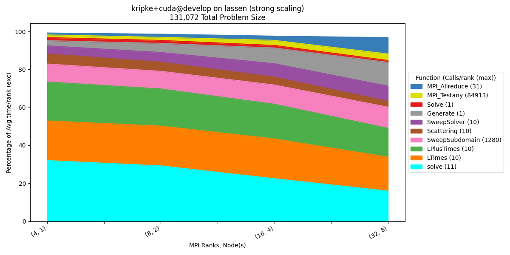
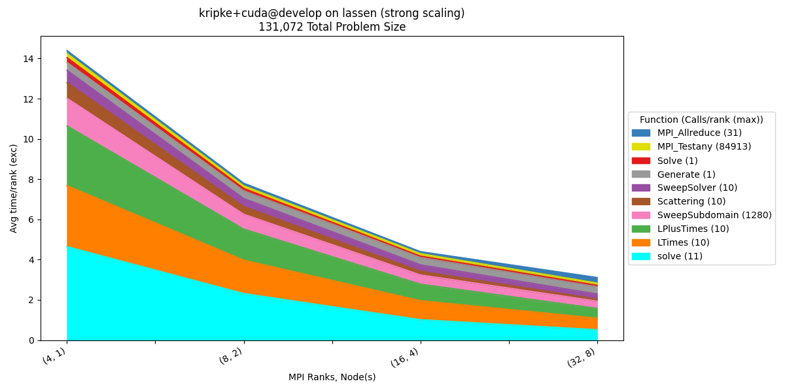
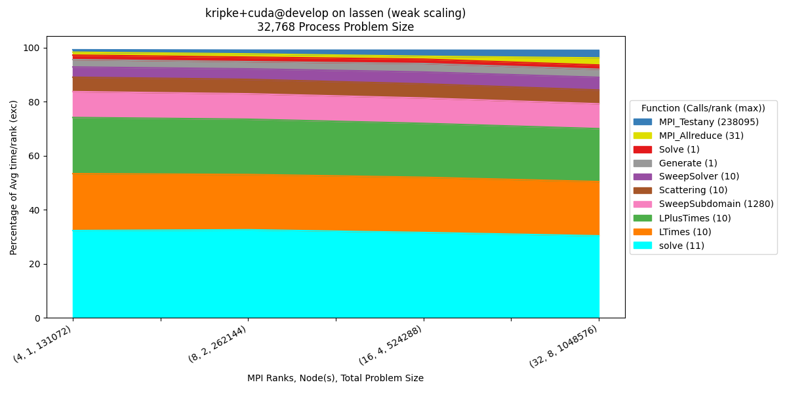
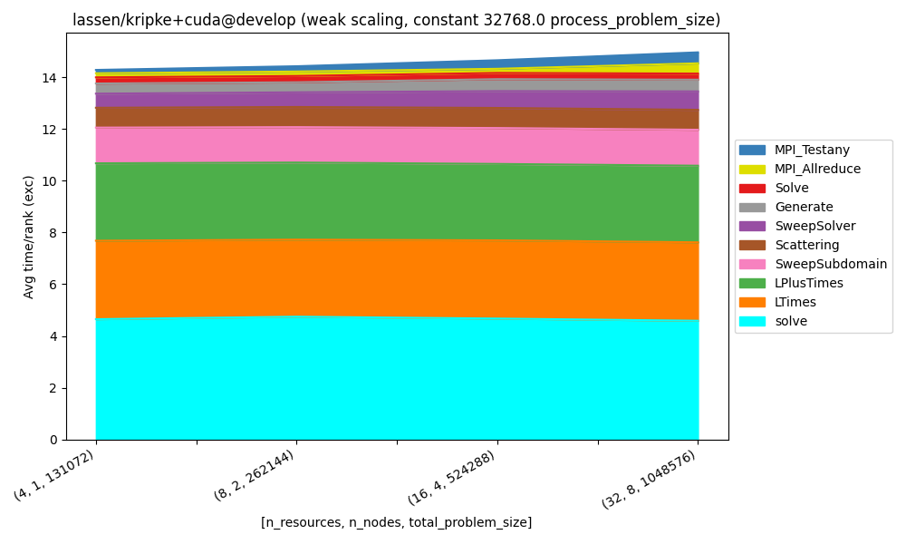
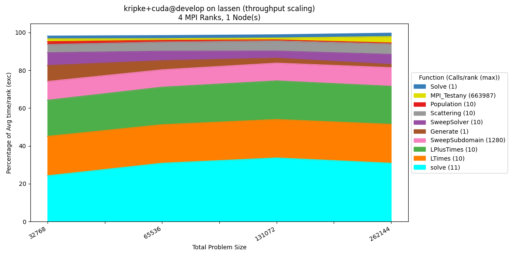
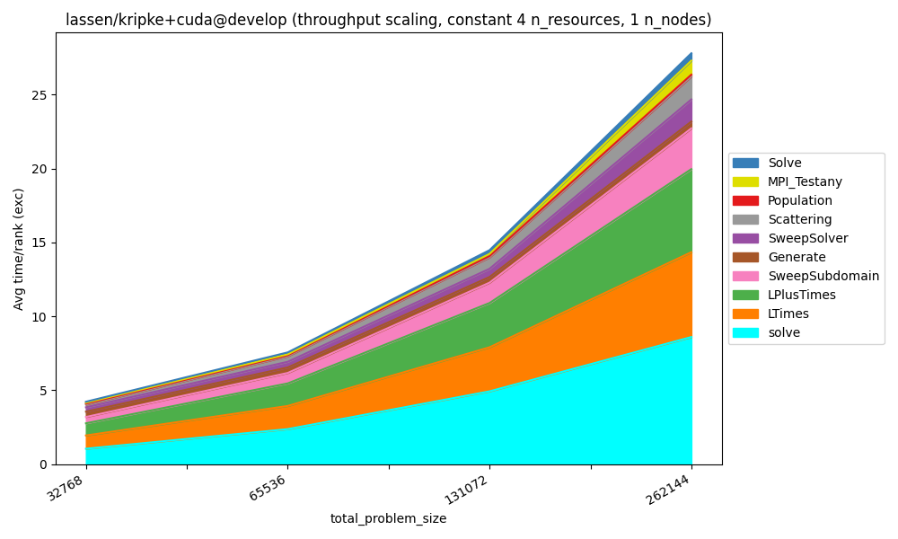
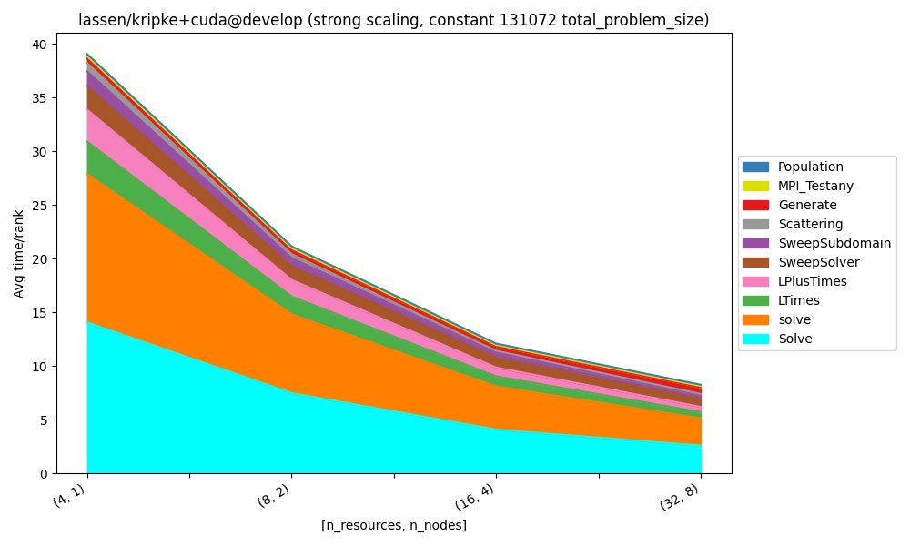

..
   Copyright 2022 Lawrence Livermore National Security, LLC and other
   Thicket Project Developers. See the top-level LICENSE file for details.

   SPDX-License-Identifier: MIT

#####################################
Canned Analysis for Scaling Studies
#####################################

The ``benchpark analyze`` command can be used to generate pre-configured
charts for analysis of scaling studies using Caliper and Thicket. 
We use `Thicket <https://github.com/LLNL/thicket>`_ to help compose and visualize
Caliper performance data collected from running our experiment with the Caliper modifier.
After running, ``ramble on``, run the ``benchpark analyze`` command on the ramble workspace directory.

.. note::

  This command required optional packages to be installed, which can be achieved with ``pip install .[analyze]`` (assuming you are in the benchpark directory)

How to Run
**********

.. code:: console

   $ benchpark analyze --workspace-dir RAMBLE_WORKSPACE_DIR <optional_arguments>

Available Arguments
*******************
.. program-output:: ../bin/benchpark analyze -h

Analysis of Strong, Weak, and Throughput Scaling of Kripke
************************************************************

Kripke Calltree

.. code::

   main
  ├─  Generate
  │  ├─  MPI_Allreduce
  │  ├─  MPI_Comm_split
  │  └─  MPI_Scan
  ├─  MPI_Allreduce
  ├─  MPI_Bcast
  ├─  MPI_Comm_dup
  ├─  MPI_Comm_free
  ├─  MPI_Comm_split
  ├─  MPI_Finalize
  ├─  MPI_Finalized
  ├─  MPI_Gather
  ├─  MPI_Get_library_version
  ├─  MPI_Initialized
  └─  Solve
    └─  solve
        ├─  LPlusTimes
        ├─  LTimes
        ├─  Population
        │  └─  MPI_Allreduce
        ├─  Scattering
        ├─  Source
        └─  SweepSolver
          ├─  MPI_Irecv
          ├─  MPI_Isend
          ├─  MPI_Testany
          ├─  MPI_Waitall
          └─  SweepSubdomain

Strong
------

Generate the Strong dataset:

.. code:: console

  $ benchpark experiment init --dest=kripke/cuda/strong kripke+cuda+strong~single_node caliper=time,mpi
  $ benchpark system init --dest=lassen llnl-sierra
  $ benchpark setup kripke/cuda/strong lassen/ wkp
  // Follow instructions for running Ramble ...

Run canned analysis:

.. code:: console

  $ benchpark analyze --workspace-dir wkp/kripke/cuda/strong/lassen/workspace/ --chart-type "percentage_time" --top-n-nodes 10

.. code:: console

   $ benchpark analyze --workspace-dir wkp/kripke/cuda/strong/lassen/workspace/ --chart-type "time" --top-n-nodes 10

Weak
----

Generate the Weak dataset:

.. code:: console

  $ benchpark experiment init --dest=kripke/cuda/weak kripke+cuda+weak~single_node caliper=time,mpi
  $ benchpark setup kripke/cuda/weak lassen/ wkp
  // Follow instructions for running Ramble ...

Run canned analysis:

.. code:: console

   $ benchpark analyze --workspace-dir wkp/kripke/cuda/weak/lassen/workspace/ --chart-type "percentage_time" --top-n-nodes 10

.. code:: console

   $ benchpark analyze --workspace-dir wkp/kripke/cuda/weak/lassen/workspace/ --chart-type "time" --top-n-nodes 10

Throughput
----------

Generate the Throughput dataset:

.. code:: console

  $ benchpark experiment init --dest=kripke/cuda/throughput kripke+cuda+throughput~single_node caliper=time,mpi
  $ benchpark setup kripke/cuda/throughput lassen/ wkp
  // Follow instructions for running Ramble ...

Run canned analysis:

.. code:: console

   $ benchpark analyze --workspace-dir wkp/kripke/cuda/throughput/lassen/workspace/ --chart-type "percentage_time" --top-n-nodes 10

.. code:: console

   $ benchpark analyze --workspace-dir wkp/kripke/cuda/throughput/lassen/workspace/ --chart-type "time" --top-n-nodes 10

Inclusive Metrics
-----------------

.. code:: console

  $ benchpark analyze --workspace-dir wkp/kripke/cuda/strong/lassen/workspace/ --chart-type "time" --y-axis-metric "Avg time/rank" --top-n-nodes 10

We can also visualize any inclusive metrics by selecting them as the ``y_axis_metric``. Here we use ``Avg time/rank`` instead of ``Avg time/rank (exc)``.
The ``main`` node is automatically removed from the figure, because this information is redundant for the inclusive metric.

