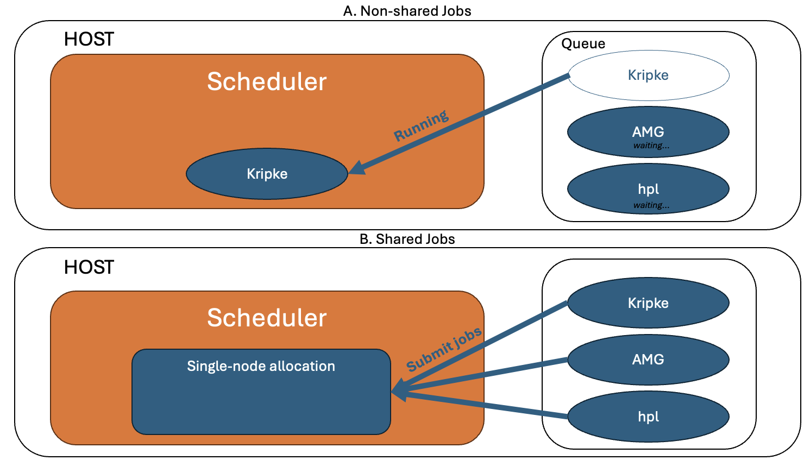

.. Copyright 2023 Lawrence Livermore National Security, LLC and other
   Benchpark Project Developers. See the top-level COPYRIGHT file for details.

   SPDX-License-Identifier: Apache-2.0

==================
CI Developer Guide
==================

This guide is intended for people who want to modify the GitHub/Gitlab CI for benchpark

--------
GitLab
--------

The Benchpark GitLab tests run on LC systems as a part of the ``https://lc.llnl.gov/gitlab``.
The goal is to build and run the benchmarks on systems with different programming models, as well as test the functionality of the benchpark library.
GitLab configuration files are located under the ``.gitlab`` folder and specified by the ``.gitlab-ci.yml`` configuration file::

   .gitlab-ci.yml
   .gitlab/
      bin/
      tests/
      utils/

1. ``.gitlab-ci.yml`` defines project-wide variables, the job stage pipeline, and different sets of tests (e.g. nightly, daily). This file also includes some pre-defined utility functions from the `LLNL/radiuss-shared-ci project <https://github.com/LLNL/radiuss-shared-ci>`_.
2. ``.gitlab/bin/`` stores "binaries" that are used during CI execution.

   Fig. 1: Running experiments using a "non-shared" strategy (A) versus a shared allocation strategy (B).

3. ``.gitlab/tests/`` Define the different types of tests. Add a benchmark to a given test by adding to the ``BENCHMARK`` list variable for the appropriate ``HOST`` and ``VARIANT``. Add tests for a system by defining a new group to the list defined under the appropriate ``parallel:matrix:``. The ``HOST`` must have existing runners on the ``https://lc.llnl.gov/gitlab`` (managed by admins) in order to actually execute. All available LC instance runners can be found `here <https://lc.llnl.gov/gitlab/benchpark/benchpark/-/settings/ci_cd#js-runners-settings>`_.
   
   a. Nightly tests (``nightly.yml``) defines all of the tests that run nightly. All of the tests for all experiments and systems are defined in this file. Tests are ran sequentially on a given system, but are parallelized across the systems (non-shared Figure 1A). The main goal for the nightly tests is to test all available programming models for as many of the benchmarks in benchpark as possible, which we post the successes/failures on the develop branch to our `CDash dashboard <https://my.cdash.org/index.php?project=Benchpark>`_. An experiment failing on the dashboard should indicate that this experiment should also fail if you try building and running yourself. 
   b. Daily tests are split into multiple categories

      i. Non-shared tests (non-shared Figure 1A) ``non_shared.yml`` operate the same way as the nightly tests and run sequentially.
      ii. Shared Flux tests (shared Figure 1B) ``shared_flux_clusters.yml`` has all of the tests that we execute on clusters running system-wide flux. The testing strategy allocates a single node and then submits all of the tests to that single node. This strategy avoids the time spent waiting for an allocation between tests.
      iii. Shared Slurm tests (shared Figure 1B) ``shared_slurm_clusters.yml`` has all of the tests that we execute on clusters running system-wide flux. The strategy for these clusters is similar to the flux clusters, but first involves starting flux on the allocated node, which is necessary since testing the benchpark workflow involves submitting a job within a job step in this case, which is not possible using slurm.
4. ``.gitlab/utils/`` contains various utility functions for:

   a. Checking machine status ``machine_checks.yml``
   b. Cancelling jobs ``cancel-flux.sh`` and ``cancel-slurm.sh``
   c. Defining common rules ``rules.yml``
   d. A reproducible script for executing an experiment in benchpark ``run-experiment.sh``
   e. Reporting GitLab status to GitHub PRs ``status.yml``.

--------
GitHub
--------
TBD

-------
CDash
-------
The successes/failures of our GitLab tests are posted to our CDash dashboard `CDash dashboard <https://my.cdash.org/index.php?project=Benchpark>`_. There is a dashboard for the nightly tests on the develop branch, and several dashboards for each system for daily PRs.

The following files are related to CDash:

1. ``CTestGitlab.cmake`` configures CTest variables, the dashboard names and runs the tests and submits the results.
2. ``CTestConfig.cmake`` sets the cdash token and configuration variables.
3. ``CMakeLists.txt`` enables CTest and adds the gitlab test.
4. ``.gitlab/utils/status.yml`` Contains the logic to run CTest after a test completes and upload the status to the Benchpark CDash dashboard.