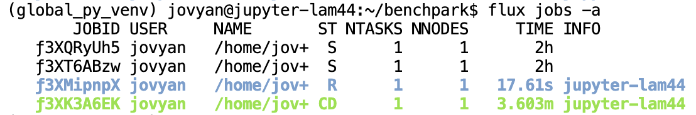
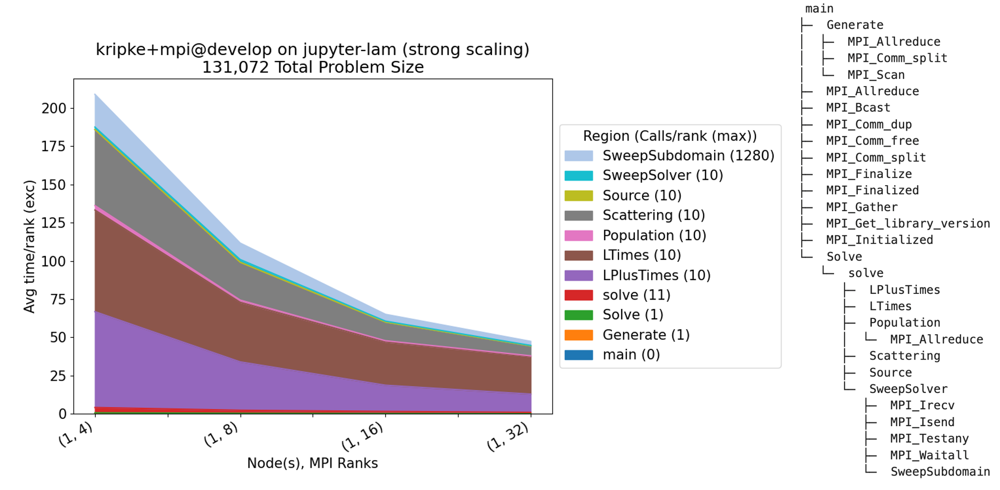

.. Copyright 2023 Lawrence Livermore National Security, LLC and other
   Benchpark Project Developers. See the top-level COPYRIGHT file for details.

   SPDX-License-Identifier: Apache-2.0

===================================================
Hello Benchpark Tutorial: Kripke Benchmark Example
===================================================

**Objective:**

This tutorial will guide you through using Benchpark to run a strong scaling
experiment with the `Kripke benchmark <https://github.com/LLNL/Kripke>`_ on an AWS instance. By the end of
this tutorial, you will be able to use Benchpark to:

* Initialize the details of a system and scaling experiment with Benchpark
* Run the scaling experiment with Ramble
* Perform pre-defined performance analysis on the results of the scaling experiment with Benchpark

**Prerequisites:**

* Access to a terminal with Benchpark installed (provided automatically by the infrastructure in our `benchpark-tutorial repository <https://github.com/llnl/benchpark-tutorial>`_)
* Basic familiarity with command-line interfaces

--------------------------------------
Step 1: Verify Benchpark Installation
--------------------------------------

First, ensure Benchpark is installed and working correctly by running:

.. code-block:: bash

    benchpark --version

You should see a version number like ``0.1.0``.

----------------------------------------------------
Step 2: Explore Available Benchmarks and Experiments
----------------------------------------------------

Next, list all available benchmarks and experiments by running:

.. code-block:: bash

    benchpark list experiments

You should see an output like:

.. code-block:: text

    Experiments:
        ...
        hpcg+single_node
        hpcg+openmp
        hpcg+strong
        hpcg+weak
        hpl+single_node
        hpl+openmp
        hpl+strong
        hpl+weak
        ior+single_node
        ior+strong
        ior+weak
        kripke+single_node
        kripke+openmp
        kripke+cuda
        kripke+rocm
        laghos+single_node
        laghos+cuda
        laghos+rocm
        lammps+single_node
        lammps+openmp
        lammps+cuda
        lammps+rocm
        lammps+strong
        ...

From this output, you can see that Benchpark experiments are represented
with Spack-like specifications (i.e., specs). For example, the spec
``kripke+single_node`` describes an experiment using the Kripke benchmark
running on a single node.

Additionally, you can get only the experiments associated with a particular
benchmark by adding :code:`--experiment <experiment_name>` to the above command.
For example, to get only the experiments associated with Kripke, run:

.. code-block:: bash

    benchpark list experiments --experiment kripke

You should see the following:

.. code-block:: text

    Experiments:
        kripke+single_node
        kripke+openmp
        kripke+cuda
        kripke+rocm

.. note::

    For Kripke, the default experiment is ``kripke+single_node``. Since single node runs are enabled by default, the ``+single_node``
    variant will be excluded from the commands below. Instead, the instructions below that use experiment specs will
    simply use ``kripke`` instead of ``kripke+single_node``.

.. _step3_label:
------------------------------------------
Step 3: Initialize Your System Description
------------------------------------------

Next, initialize the description of the AWS system by running the commands below:

.. code-block:: bash

   cd benchpark
   benchpark system init --dest=hpdc-tutorial aws-tutorial instance_type=c7i.12xlarge

The :code:`benchpark system init` command generates Ramble and Spack configuration
files that describe the system on which you are running. The system is specified using
a Spack-like specification (i.e., spec). In the command above, the spec (i.e., :code:`aws-tutorial instance_type=c7i.12xlarge`)
defines a system running with `our tutorial infrastructure on AWS <https://github.com/llnl/benchpark-tutorial>`_ that uses the `c7i.12xlarge instance type <https://aws.amazon.com/ec2/instance-types/c7i/>`_.

After running the command above, you should see the following files in the ``hpdc-tutorial`` directory:

* ``system_id.yaml``: a Benchpark configuration file that contains high-level metadata about the system
* ``software.yaml``: a Ramble configuration file specifying the default packages to use for software like compilers and MPI
* ``variables.yaml``: a Ramble configuration file defining variables that are needed for job script generation and scheduling (e.g., type of scheduler, number of cores per node)
* ``auxiliary_software_files/compilers.yaml``: a Spack configuration file defining available compilers on the system
* ``auxiliary_software_files/packages.yaml``: a Spack configuration file defining available software on the system

----------------------------------
Step 4: Initialize Your Experiment
----------------------------------

Next, initialize the Kripke scaling experiment used in this tutorial by running:

.. code-block:: bash

    benchpark experiment init --dest=kripke-benchmark kripke scaling=strong caliper=time,mpi

Similar to :code:`benchpark system init`, the :code:`benchpark experiment init` command generates
the Ramble configuration file to describe the experiment to be run. The experiment is specified
using a Spack-like specification (i.e., spec). In the command above, the spec (i.e., :code:`kripke scaling=strong caliper=time,mpi`)
defines a strong-scaling experiment running Kripke with Caliper support. The spec also enables Caliper's time measurement with MPI
support at runtime.

After running the command above, you should see a ``ramble.yaml`` file in the ``kripke-benchmark`` directory.

--------------------------------------
Step 5: Setup Your Benchpark Workspace
--------------------------------------

After initializing the system description and experiment, setup a Benchpark workspace by running:

.. code-block:: bash

   benchpark setup kripke-benchmark/ hpdc-tutorial/ wkp/

This command takes the configuration files stored in the output directories of :code:`benchpark experiment init` (i.e., ``kripke-benchmark/``)
and :code:`benchpark system init` (i.e., ``hpdc-tutorial/``) and combines them to generate a Benchpark workspace.
A Benchpark workspace contains everything that Benchpark, Ramble, and Spack need to build and run your experiment, including:

* Clones of Spack and Ramble
* A ``setup.sh`` script that calls Spack and Ramble's setup scripts
* A Ramble workspace

To start using your Benchpark workspace, run:

.. code-block:: bash

    . /home/jovyan/benchpark/wkp/setup.sh

.. _step6_label:
-----------------------------------------------------------------
Step 6: Build Software Dependencies and Generate Experiment Files
-----------------------------------------------------------------

Next, build any necessary software and generate all necessary files for the Kripke scaling experiment by running:

.. code-block:: bash

    ramble --disable-progress-bar --workspace-dir /home/jovyan/benchpark/wkp/kripke-benchmark/hpdc-tutorial/workspace workspace setup

This command does 2 things. First, it builds all necessary software using Spack. Building the software may take a while to complete, depending
on how many external packages are contained in the system definition from :ref:`Step 3 <step3_label>`. For this tutorial, it should take roughly 5 minutes.
Second, this command configures files (e.g. submission scripts) needed to perform the runs that make up the current experiment.
For each run in the experiment, a directory containing the files necessary for the run will be created under ``/home/jovyan/benchpark/wkp/kripke-benchmark/hpdc-tutorial/workspace/experiments/kripke/kripke``. 
If the command is successful, you should see something like:

.. code-block:: text

    ==> Streaming details to log:
    ==>   /home/jovyan/benchpark/wkp/kripke-benchmark/hpdc-tutorial/workspace/logs/setup.2025-07-09_18.08.23.out
    ==>   Setting up 4 out of 4 experiments:
    ==> Experiment #1 (1/4):
    ==>     name: kripke.kripke.kripke_kripke_single_node_strong_scaling_caliper_time_mpi_2_2_1_64_64_32_64_1_128_128_4_4
    ==>     root experiment_index: 1
    ==>     log file: /home/jovyan/benchpark/wkp/kripke-benchmark/hpdc-tutorial/workspace/logs/setup.2025-07-09_18.08.23/kripke.kripke.kripke_kripke_single_node_strong_scaling_caliper_time_mpi_2_2_1_64_64_32_64_1_128_128_4_4.out
    ==>   Returning to log file: /home/jovyan/benchpark/wkp/kripke-benchmark/hpdc-tutorial/workspace/logs/setup.2025-07-09_18.08.23.out
    ==> Experiment #2 (2/4):
    ==>     name: kripke.kripke.kripke_kripke_single_node_strong_scaling_caliper_time_mpi_2_2_2_64_64_32_64_1_128_128_4_8
    ==>     root experiment_index: 2
    ==>     log file: /home/jovyan/benchpark/wkp/kripke-benchmark/hpdc-tutorial/workspace/logs/setup.2025-07-09_18.08.23/kripke.kripke.kripke_kripke_single_node_strong_scaling_caliper_time_mpi_2_2_2_64_64_32_64_1_128_128_4_8.out
    ==>   Returning to log file: /home/jovyan/benchpark/wkp/kripke-benchmark/hpdc-tutorial/workspace/logs/setup.2025-07-09_18.08.23.out
    ==> Experiment #3 (3/4):
    ==>     name: kripke.kripke.kripke_kripke_single_node_strong_scaling_caliper_time_mpi_4_2_2_64_64_32_64_1_128_128_4_16
    ==>     root experiment_index: 3
    ==>     log file: /home/jovyan/benchpark/wkp/kripke-benchmark/hpdc-tutorial/workspace/logs/setup.2025-07-09_18.08.23/kripke.kripke.kripke_kripke_single_node_strong_scaling_caliper_time_mpi_4_2_2_64_64_32_64_1_128_128_4_16.out
    ==>   Returning to log file: /home/jovyan/benchpark/wkp/kripke-benchmark/hpdc-tutorial/workspace/logs/setup.2025-07-09_18.08.23.out
    ==> Experiment #4 (4/4):
    ==>     name: kripke.kripke.kripke_kripke_single_node_strong_scaling_caliper_time_mpi_4_4_2_64_64_32_64_1_128_128_4_32
    ==>     root experiment_index: 4
    ==>     log file: /home/jovyan/benchpark/wkp/kripke-benchmark/hpdc-tutorial/workspace/logs/setup.2025-07-09_18.08.23/kripke.kripke.kripke_kripke_single_node_strong_scaling_caliper_time_mpi_4_4_2_64_64_32_64_1_128_128_4_32.out
    ==>   Returning to log file: /home/jovyan/benchpark/wkp/kripke-benchmark/hpdc-tutorial/workspace/logs/setup.2025-07-09_18.08.23.out

------------------------------------------
Step 7: Run Kripke Experiment using Ramble
------------------------------------------

Next, run the Kripke scaling experiment by running the following command:

.. code-block:: bash

    ramble --disable-progress-bar --workspace-dir /home/jovyan/benchpark/wkp/kripke-benchmark/hpdc-tutorial/workspace on

This command simply passes the submission scripts generated in :ref:`Step 6 <step6_label>` to the system's resource manager (which is specified
in the files generated by :code:`benchpark system init`). For the AWS
infrastructure used in this tutorial, the resource manager is LLNL's `Flux resource manager <https://flux-framework.org/>`_.

If the above command is successful, you should see something like:

.. code-block:: bash

    ==> Streaming details to log:
    ==>   /home/jovyan/benchpark/wkp/kripke-benchmark/hpdc-tutorial/workspace/logs/execute.2025-07-09_18.14.08.out
    ==>   Executing 4 out of 4 experiments:
    ==>   Log files for experiments are stored in: /home/jovyan/benchpark/wkp/kripke-benchmark/hpdc-tutorial/workspace/logs/execute.2025-07-09_18.14.08
    ==> Running executors...
    ƒV54uD5o5  
    ƒV57fKkEK  
    ƒV5ANUS6s  
    ƒV5D498h5

The final lines printed by the :code:`ramble on` command are the job IDs produced by the system resource manager. You can use
these IDs to track the progress of the jobs in your experiment. For example, with Flux, you can see job status by running:

.. code-block:: bash

   flux jobs -a

This command will produce an output like:

.. note::
    If you are running on our `AWS infrastructure <https://github.com/llnl/benchpark-tutorial>`_, it should take roughly 8-9 minutes for all jobs to finish running. Additionally,
    only one job will run at a time under our infrastructure because each user only has 1 node. If you are running on an HPC system,
    expect the jobs to complete faster.

After all the jobs are finished, each job directory (i.e., subdirectories of ``/home/jovyan/benchpark/wkp/kripke-benchmark/hpdc-tutorial/workspace/experiments/kripke/kripke``)
will contain a Caliper output file (i.e., a ``.cali`` file) containing performance data for the job.

------------------------
Step 8: Analyze Results
------------------------

Finally, perform pre-defined analysis on the experiment by running:

.. code-block:: bash

    benchpark analyze --workspace-dir /home/jovyan/benchpark/wkp/kripke-benchmark/hpdc-tutorial/workspace --no-mpi --chart-fontsize 15

This command reads in the Caliper files generated by the experiment and generates several files, such as the plot and calling context tree shown below.
These files can be found in ``/home/jovyan/benchpark/wkp/kripke-benchmark/hpdc-tutorial/workspace/analyze``.

----------
Next Steps
----------

Now that you know how to initialize, run, and analyze the performance of an experiment, check out
our :doc:`Benchpark Workflow <./benchpark-workflow>` page, which will walk you through the steps to take to use different systems
benchmarks, and experiments.
