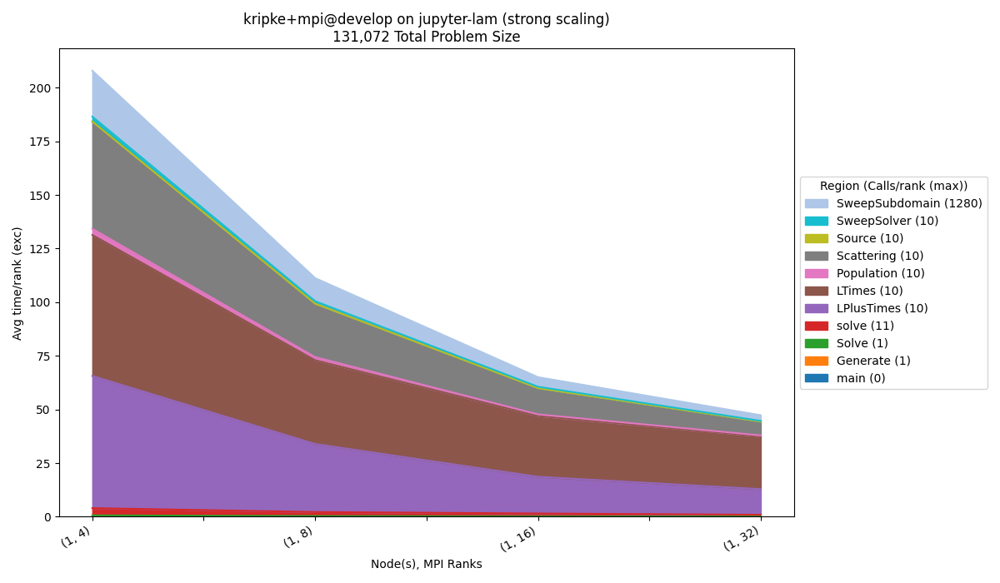
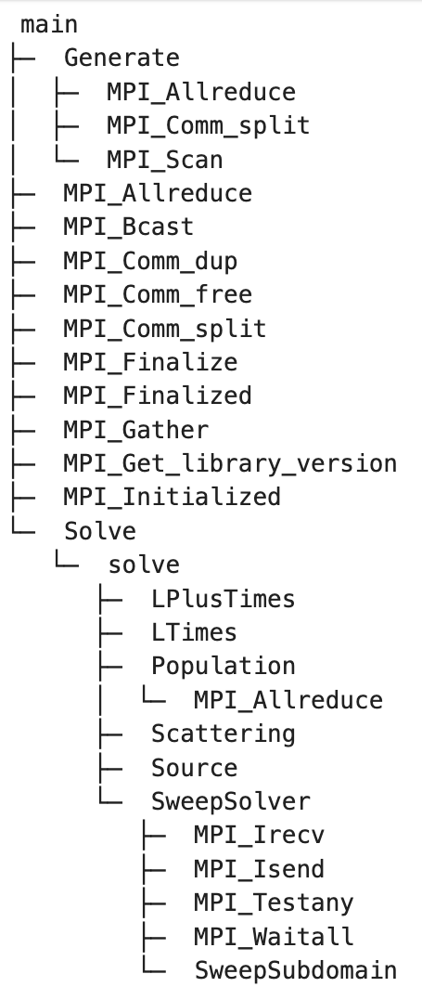

.. Copyright 2023 Lawrence Livermore National Security, LLC and other
   Benchpark Project Developers. See the top-level COPYRIGHT file for details.

   SPDX-License-Identifier: Apache-2.0

===================================================
Hello Benchpark Tutorial: Kripke Benchmark Example
===================================================

--------------------------------------
Step 1: Verify Benchpark Installation
--------------------------------------

First we will ensure Benchpark is installed and working correctly::

    benchpark --version

Which will return the version of benchpark::

    0.1.0

----------------------------------------------------
Step 2: Explore Available Benchmarks and Experiments
----------------------------------------------------

We will list all available benchmarks and experiments::

    benchpark list
    benchpark list experiments --experiment kripke

We will use the **Kripke** experiment for this tutorial.

-----------------------------------------------
Step 3: Initialize Your Experiment Environment
-----------------------------------------------

We will set up an AWS instance type and Kripke benchmark variant.

1. **Navigate** to your Benchpark directory::

    cd benchpark

2. **Initialize** the AWS system environment::

    benchpark system init --dest=hpdc-tutorial aws-tutorial instance_type=c7i.24xlarge

3. **Initialize** the Kripke benchmark experiment::

    benchpark experiment init --dest=kripke-benchmark kripke scaling=strong caliper=time,mpi

---------------------------------------------------
Step 4: Setup Your Workspace with Ramble and Spack
---------------------------------------------------

**Initialize** the workspace directory::

    benchpark setup kripke-benchmark/ hpdc-tutorial/ wkp/

.. note::

    This command configures a Ramble workspace using the system specification from ``benchpark system init``
    and experiment specification from ``benchpark experiment init``. Ramble can then use this workspace to
    build, run, and configure the Kripke benchmark for the AWS System we are using for this tutorial.

-----------------------------------------
Step 5: Build and Configure Dependencies
-----------------------------------------

.. note::

    Benchpark will provide next steps to the console but they are also provided here.

1. **Configure** the dependencies for Ramble and Spack::

    . /home/jovyan/benchpark/wkp/setup.sh

2. **Build** the Ramble experiment workspace::

    ramble --disable-progress-bar --workspace-dir /home/jovyan/benchpark/wkp/kripke-benchmark/hpdc-tutorial/workspace workspace setup

This command does 2 main things. First, it builds all necessary software using Spack. This process may take some time (2-3 minutes).
Second, this command configures files (e.g. Flux submission script) needed to perform the runs that make up the current experiment.
For each run, a directory will be created under ``benchpark/wkp/kripke-benchmark/hpdc-tutorial/workspace/experiments/kripke/kripke``. 
If the setup is successful, you will see something like this after the setup command::

    ==> Streaming details to log:
    ==>   /home/jovyan/benchpark/wkp/kripke-benchmark/hpdc-tutorial/workspace/logs/setup.2025-07-09_18.08.23.out
    ==>   Setting up 4 out of 4 experiments:
    ==> Experiment #1 (1/4):
    ==>     name: kripke.kripke.kripke_kripke_single_node_strong_scaling_caliper_time_mpi_2_2_1_64_64_32_64_1_128_128_4_4
    ==>     root experiment_index: 1
    ==>     log file: /home/jovyan/benchpark/wkp/kripke-benchmark/hpdc-tutorial/workspace/logs/setup.2025-07-09_18.08.23/kripke.kripke.kripke_kripke_single_node_strong_scaling_caliper_time_mpi_2_2_1_64_64_32_64_1_128_128_4_4.out
    ==>   Returning to log file: /home/jovyan/benchpark/wkp/kripke-benchmark/hpdc-tutorial/workspace/logs/setup.2025-07-09_18.08.23.out
    ==> Experiment #2 (2/4):
    ==>     name: kripke.kripke.kripke_kripke_single_node_strong_scaling_caliper_time_mpi_2_2_2_64_64_32_64_1_128_128_4_8
    ==>     root experiment_index: 2
    ==>     log file: /home/jovyan/benchpark/wkp/kripke-benchmark/hpdc-tutorial/workspace/logs/setup.2025-07-09_18.08.23/kripke.kripke.kripke_kripke_single_node_strong_scaling_caliper_time_mpi_2_2_2_64_64_32_64_1_128_128_4_8.out
    ==>   Returning to log file: /home/jovyan/benchpark/wkp/kripke-benchmark/hpdc-tutorial/workspace/logs/setup.2025-07-09_18.08.23.out
    ==> Experiment #3 (3/4):
    ==>     name: kripke.kripke.kripke_kripke_single_node_strong_scaling_caliper_time_mpi_4_2_2_64_64_32_64_1_128_128_4_16
    ==>     root experiment_index: 3
    ==>     log file: /home/jovyan/benchpark/wkp/kripke-benchmark/hpdc-tutorial/workspace/logs/setup.2025-07-09_18.08.23/kripke.kripke.kripke_kripke_single_node_strong_scaling_caliper_time_mpi_4_2_2_64_64_32_64_1_128_128_4_16.out
    ==>   Returning to log file: /home/jovyan/benchpark/wkp/kripke-benchmark/hpdc-tutorial/workspace/logs/setup.2025-07-09_18.08.23.out
    ==> Experiment #4 (4/4):
    ==>     name: kripke.kripke.kripke_kripke_single_node_strong_scaling_caliper_time_mpi_4_4_2_64_64_32_64_1_128_128_4_32
    ==>     root experiment_index: 4
    ==>     log file: /home/jovyan/benchpark/wkp/kripke-benchmark/hpdc-tutorial/workspace/logs/setup.2025-07-09_18.08.23/kripke.kripke.kripke_kripke_single_node_strong_scaling_caliper_time_mpi_4_4_2_64_64_32_64_1_128_128_4_32.out
    ==>   Returning to log file: /home/jovyan/benchpark/wkp/kripke-benchmark/hpdc-tutorial/workspace/logs/setup.2025-07-09_18.08.23.out

-----------------------------------------
Step 6: Run Kripke Experiments with Flux
-----------------------------------------

**Run** the Kripke experiments, which will launch jobs through the `Flux resource manager <https://flux-framework.org/>`_::

    ramble --disable-progress-bar --workspace-dir /home/jovyan/benchpark/wkp/kripke-benchmark/hpdc-tutorial/workspace on

This should return something like this on the terminal after running the command::

    ==> Streaming details to log:
    ==>   /home/jovyan/benchpark/wkp/kripke-benchmark/hpdc-tutorial/workspace/logs/execute.2025-07-09_18.14.08.out
    ==>   Executing 4 out of 4 experiments:
    ==>   Log files for experiments are stored in: /home/jovyan/benchpark/wkp/kripke-benchmark/hpdc-tutorial/workspace/logs/execute.2025-07-09_18.14.08
    ==> Running executors...
    ƒV54uD5o5  
    ƒV57fKkEK  
    ƒV5ANUS6s  
    ƒV5D498h5

.. note::

    You can check on the progress of your runs by running the command::

        flux jobs [-a]

    The -a is optional; adding it to the command will show all the jobs submitted including jobs that are pending, currently running, and completed jobs.

The experiments will run sequentially, and the total time to complete all four experiments should be 8-9 minutes. Upon completion, each
experiment will generate a caliper file. Running the command :code:`flux jobs -a` will show all the jobs including pending, running, and completed jobs. 
A pending job will be colored black with ``S`` as its status, a running job will be colored blue with ``R`` as its status, and a completed job will 
be green with ``CD`` as its status (Example below):

    .. image:: ./flux_jobs_a_output.png
       :alt: Example output of flux jobs -a
       :width: 750px
       :align: center

------------------------
Step 7: Analyze Results
------------------------

1. **Conduct** pre-defined analysis with Benchpark::

    benchpark analyze --workspace-dir /home/jovyan/benchpark/wkp/kripke-benchmark/hpdc-tutorial/workspace

2. **Navigate** to ``/home/jovyan/benchpark/wkp/kripke-benchmark/hpdc-tutorial/workspace/analyze``. This directory will contain the results from the analysis,
   including the graph below:

