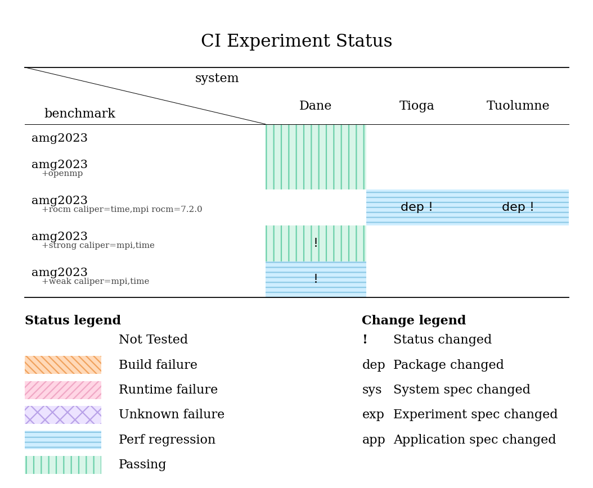

..
    Copyright 2023 Lawrence Livermore National Security, LLC and other
    Benchpark Project Developers. See the top-level COPYRIGHT file for details.

    SPDX-License-Identifier: Apache-2.0

###################
 Experiment Status
###################

This page demonstrates how to reproduce a portion of Benchpark's CI to generate the
experiment status table. In this example, we run the same amg2023 experiment setup two
times on the same system with different versions of ROCm. Then, we collect the metadata
output by each generated workspace. Finally, we compare the metadata to identify what
changed between the two runs.

In the GitLab CI pipeline, the same collected metadata is combined with job status to
produce an experiment status table. The table at the end of this page shows the kind of
summary produced by that pipeline.

*************************
 Prepare the Environment
*************************

1. Log in to Tioga.
2. Clone Benchpark and enter the repository:

   ::

       git clone https://github.com/LLNL/benchpark.git
       cd benchpark

3. Create and activate a Python virtual environment:

   ::

       python3 -m venv env
       . env/bin/activate
       pip install -r requirements.txt

******************
 Collect Metadata
******************

First collect metadata for ``amg2023`` on Tioga with ROCm 6.4.2:

::

    ./bin/benchpark system init --dest=tioga_rocm_6.4.2 llnl-elcapitan cluster=tioga rocm=6.4.2
    ./bin/benchpark experiment init --dest=amg2023 tioga_rocm_6.4.2 amg2023 +rocm caliper=time,mpi
    ./bin/benchpark setup tioga_rocm_6.4.2/amg2023 wkp/
    . wkp/setup.sh
    cd ./wkp/tioga_rocm_6.4.2/amg2023/workspace/
    ramble --workspace-dir . workspace setup
    ramble --workspace-dir . on

Return to the Benchpark repository root, then repeat the workflow with ROCm 7.2.0 (still
on Tioga).

::

    cd ~/benchpark
    ./bin/benchpark system init --dest=tioga_rocm_7.2.0 llnl-elcapitan cluster=tioga rocm=7.2.0
    ./bin/benchpark experiment init --dest=amg2023 tioga_rocm_7.2.0 amg2023 +rocm caliper=time,mpi
    ./bin/benchpark setup tioga_rocm_7.2.0/amg2023 wkp/
    . wkp/setup.sh
    cd ./wkp/tioga_rocm_7.2.0/amg2023/workspace/
    ramble --workspace-dir . workspace setup
    ramble --workspace-dir . on

******************
 Inspect Metadata
******************

After both runs complete, return to the Benchpark repository root:

::

    cd ~/benchpark

Each workspace outputs a ``githash_metadata.json`` file for the concrete experiment
instance that was generated and run. Compare the two locally generated metadata files
using the ``compare-githash-metadata.sh`` script:

::

    . .gitlab/utils/compare-githash-metadata.sh \
        wkp/tioga_rocm_6.4.2/amg2023/workspace/experiments/amg2023/problem1/amg2023_problem1_test_mpi_rocm_no_scaling_caliper_time_mpi_80_80_40_2_2_1_4/githash_metadata.json \
        wkp/tioga_rocm_7.2.0/amg2023/workspace/experiments/amg2023/problem1/amg2023_problem1_test_mpi_rocm_no_scaling_caliper_time_mpi_80_80_40_2_2_1_4/githash_metadata.json

The script compares the software stacks of the two runs, so you can more easily identify
what software packages have changed between the runs. In this example, the benchmark and
experiment (amg2023 on Tioga) are the same, but the ROCm version differs. The changed
packages impacted by the difference in the ROCm version are reported in the metadata.
Some software packages indicate code changes by releasing (or tagging) new versions,
while others use git commits, so we report both in the script. The output of the script
is shown below.

::

    ======[PACKAGE GITHASH SUMMARY]======
    [amg2023]: has no version changes.
    [amg2023]: has no commit changes.
    [adiak]: has no version changes.
    [adiak]: has no commit changes.
    [caliper]: has no version changes.
    [caliper]: has no commit changes.
    [cce]: changed versions from 20.0.0-rocm6.4.2 to 21.0.1-rocm7.2.0.
    [cce]: has no commit changes.
    [cmake]: has no version changes.
    [cmake]: has no commit changes.
    [compiler-wrapper]: has no version changes.
    [compiler-wrapper]: has no commit changes.
    [cray-mpich-gtl]: has no version changes.
    [cray-mpich-gtl]: has no commit changes.
    [glibc]: has no version changes.
    [glibc]: has no commit changes.
    [gmake]: has no version changes.
    [gmake]: has no commit changes.
    [hip]: changed versions from 6.4.2 to 7.2.0.
    [hip]: has no commit changes.
    [hsa-rocr-dev]: changed versions from 6.4.2 to 7.2.0.
    [hsa-rocr-dev]: has no commit changes.
    [hypre]: has no version changes.
    [hypre]: has no commit changes.
    [intel-oneapi-mkl]: has no version changes.
    [intel-oneapi-mkl]: has no commit changes.
    [llvm-amdgpu]: changed versions from 6.4.2 to 7.2.0.
    [llvm-amdgpu]: has no commit changes.
    [umpire]: has no version changes.
    [umpire]: has no commit changes.
    =====================================

*****************
 CI Status Table
*****************

In a full GitLab CI run, we combine the same metadata comparison with pipeline job
status. The resulting table is generated as a file at the end of the CI pipeline. It
lets developers see both the final state of each experiment and a possible reason for a
result differing from a previous related run. The table is meant to be a diagnostic tool
to narrow the investigation of new failures or performance regressions, so a developer
can know where to explore further. The table alone does not prove causality.

    Example experiment status table generated at the end of a GitLab CI pipeline. The
    filled cells show experiment status (e.g., build failure, runtime failure), while
    labels such as ``dep`` or ``!`` identify the type of metadata change. In this
    example, benchmark ``amg2023 +rocm`` on the Tioga and Tuolumne systems show a
    performance regression associated with a package change. This performance regression
    is different from the last time this benchmark ran on these systems, so it is marked
    with a ``!``. When investigating this regression, a developer can more easily
    associate the ROCm change with the performance regression.
