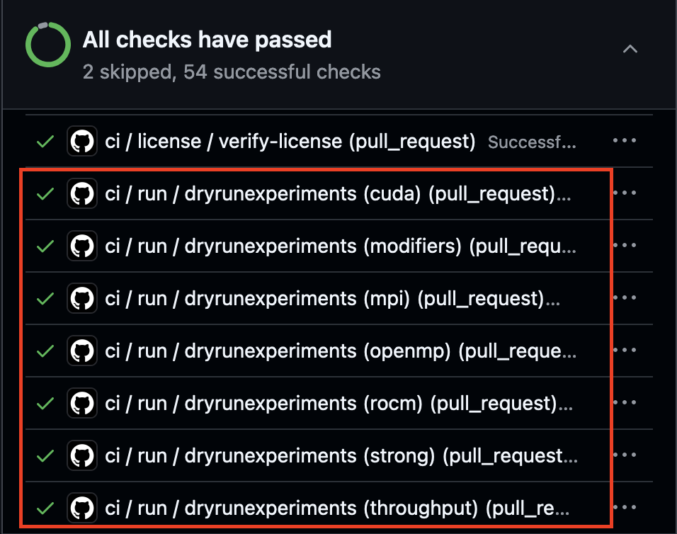

.. Copyright 2023 Lawrence Livermore National Security, LLC and other
   Benchpark Project Developers. See the top-level COPYRIGHT file for details.

   SPDX-License-Identifier: Apache-2.0

=========================
Testing Your Contribution
=========================

   Fig. 1: Example Dryruns

If you are contributing a system or experiment to benchpark you must check that it is passing the dryrun tests before your pull request will be merged. 
These tests are indicated by the GitHub ``ci/run/dryrunexperiments`` (Figure 1) tests in the pull request.
Dry run tests **do not** build your benchmark or run your experiments, they do:
1. Verify that your experiment/system is able to be initialized based on the programming models and scaling types you have included in your experiment class.
2. Verify that you have defined the necessary experiment variables for benchpark and ramble to generate your experiment.

1. If adding an experiment:
  
  a. Your experiment will be tested for each system that supports those programming models and for each scaling type that your experiment inherits.
2. If adding a system:

  a. Your system will be tested for each experiment in benchpark that is able to run for the programming models in ``self.programming_models``.

If all of the ``dryrunexperiments`` tests pass, your experiment/system has been successfully tested.
